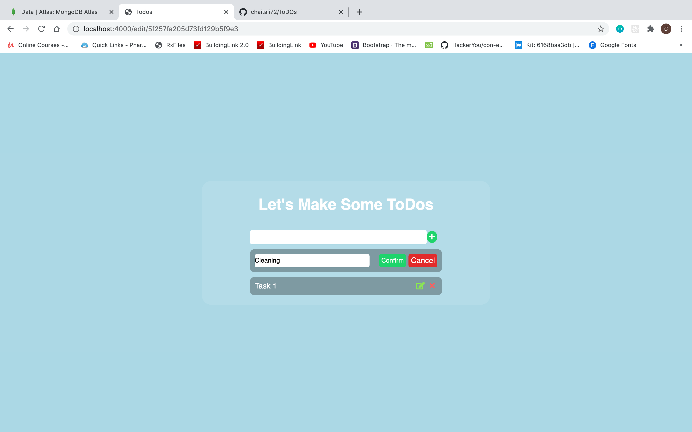

# ToDOs
# ToDOs
Simple To-do List App with Node.js ,MongoDB ,Express And EJS.
#Basics :

Node.js: Node.js is a platform built on Chrome’s JavaScript runtime for easily building fast and scalable network applications. Node.js uses an event-driven, non-blocking I/O model that makes it lightweight and efficient, perfect for data-intensive real-time applications that run across distributed devices.

MongoDB: MongoDB stores data in flexible, JSON-like documents, meaning fields can vary from document to document and data structure can be changed over time.

Express : Express is a minimal and flexible Node.js web application framework that provides a robust set of features for web and mobile applications.

CRUD: CRUD stands for Create, Read, Update and Delete. Which are the basic operations that a simple web app would be designed to achieve. 

